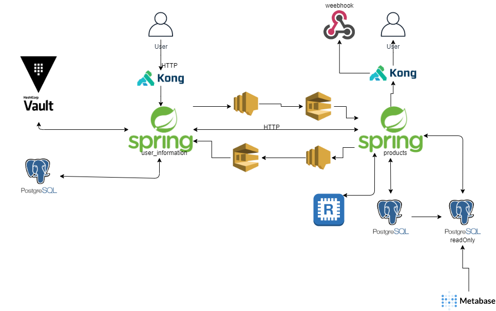

# Desenho arquitetural

## Decisão arquitetural

Baseado em 2 microserviços em spring boot com banco de dados em postgres e utilizando kubernetes para escalar automáticamente, aws(sqs e sns) para servir como mensageria, redis para cachear as requisiçoes, vault para guardar informaçoes sensíveis do usuário.

## Micro serviço user-information
 
Responsável por guardar informações do usuário e informações sensíveis, a API recebe informação(em um formato de DTOs para que a entidade não seja exposta para a API, antes de ser feita a persitencia é feito um mapper para a entidade) passa pelo API gateway(Kong) e persiste as informações na base de dados e também no vault. A base de dados é persistido informações básicas do usuário, como cnpj, nome,endereço... No vault é salvo as informações sensiveis como formas de pagamentos, chaves de pix, cartoes de créditos... A comunicaçao com micro serviços é feito assyncronamente via mensageria utilizando AWS com o uso de tópicos e filas(utilizando tanto padrões como COMMANDS,EVENTS). Também é possível requisições via HTTP.

## Micro serviço products

Responsável por armazenar informações sobre os produtos e um controle de estoque, acaba possuindo uma base de dados replica, apenas para consultas, para que seja um pouco mais performática e escalável. O acesso é via HTTP o usuário faz um POST para salvar as informações e é persistida na base de dados e replicado também para base readonly, caso o HTTP seja um GET, essa informação pode estar cacheada no REDIS. Caso seja necessário pegar alguma informação do micro serviço user-information, será feita assyncronamente utilizando mensageria, será feito o pedido e aguardado o retorno por tópico mais fila. A API pode devolver os dados via webhook, será necessário realizar um pedido de lote e devolveremos a informação no lugar que está inscrito.
Uso do metabase para coleta de dados internos, podendo gerar dashboards para métricas, coleta de dados para campanhas e afins, dessa maneira podemos rodar queries pesadas que não irá impactar o produto, o banco pode estar d-1 caso necessite que os dados sejam mais precisos a cada X horas fazemos a syncronia.

## Possíveis problemas ou melhorias

- Garantia de entrega das mensagens, utilizando apenas o sqs e sns não garantimos que as mensagens sejam entregues, sendo assim necessitando optar por algum framework de mercado ou então construindo algo que faça algo parecido com algum de mercado.
- Um alto input de dados nos micro serviços, por estar ligado com um API gateway direto com a aplicação, esse é um ponto fácil de gargalo. Pode ser pensado em algo como mensageria/lambda aonde o frontEnd ao envéz de passar pela aplicação, iria para um tópico aonde uma fila estaria inscrita nesse tópico e consequentemente a aplicação consumiria essa informação.
- Custo em manter replicas dos bancos, caso sejam extremamente grandes...
